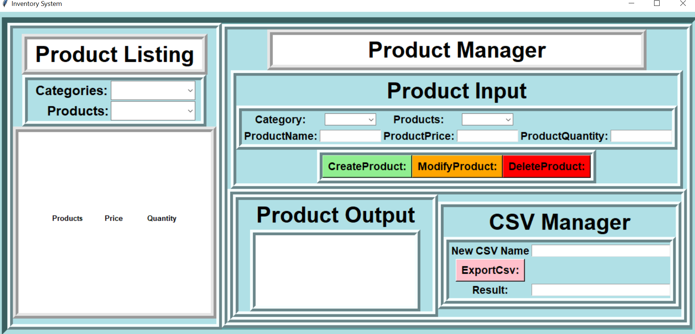
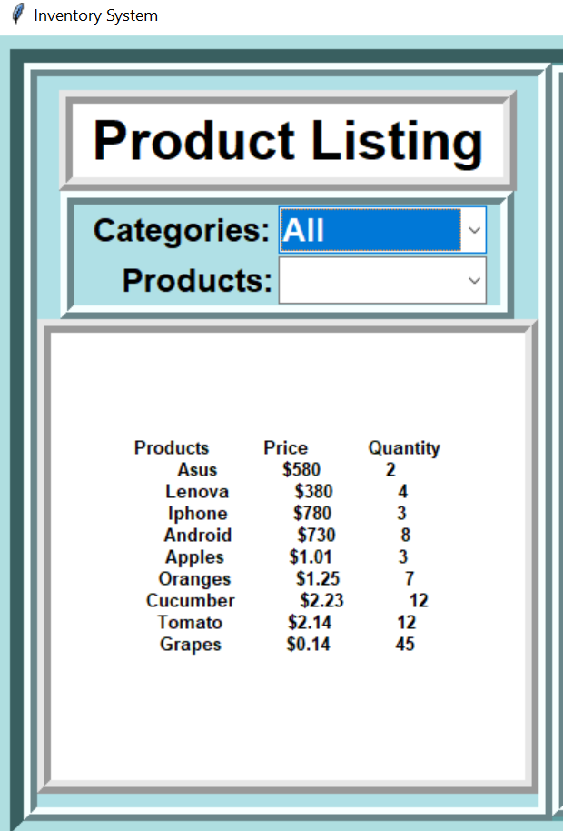
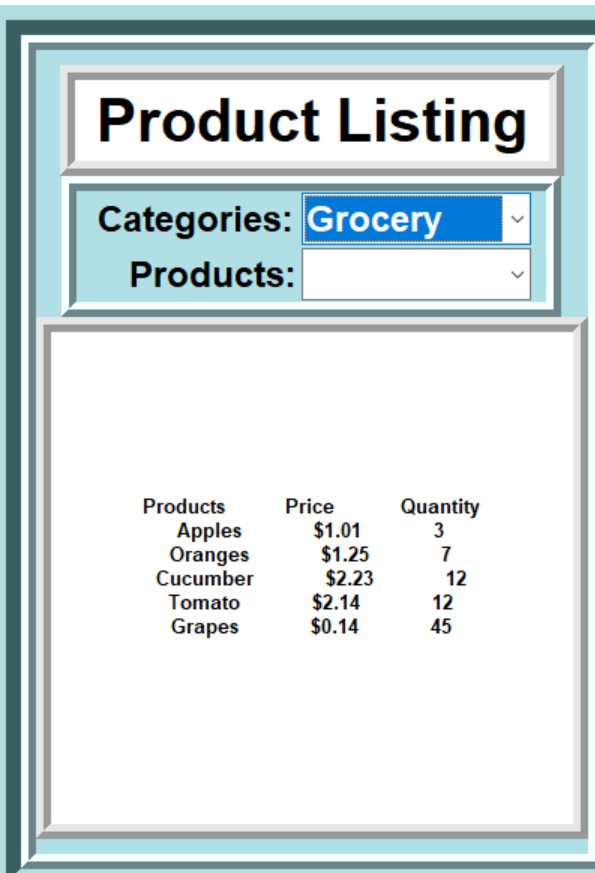
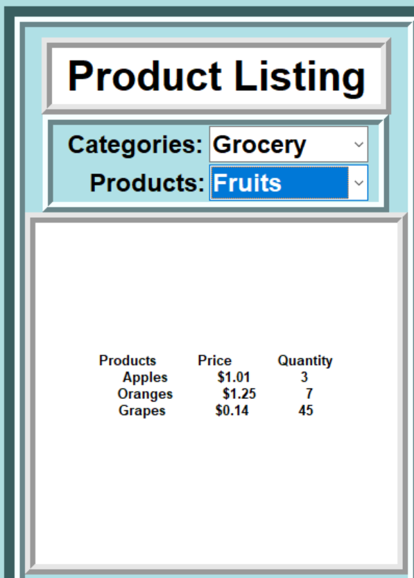
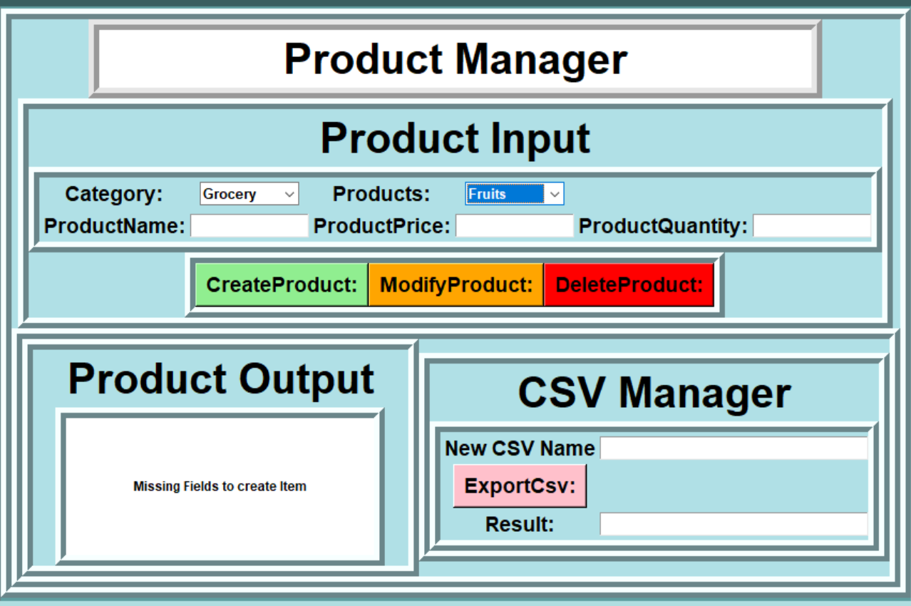
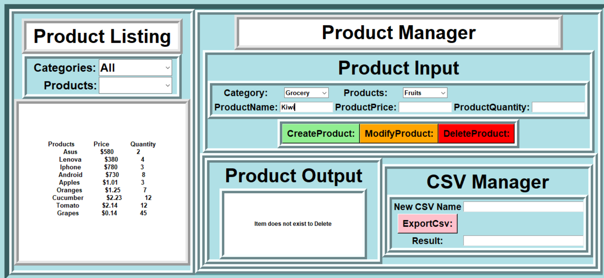
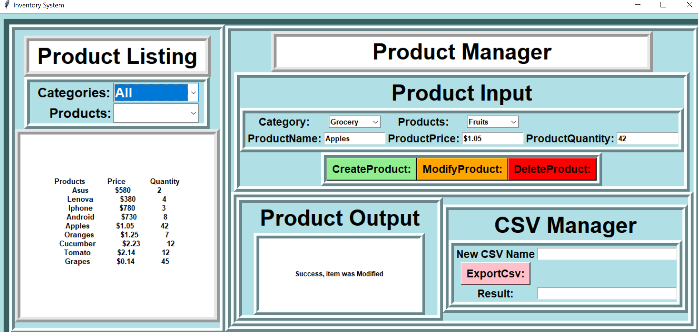
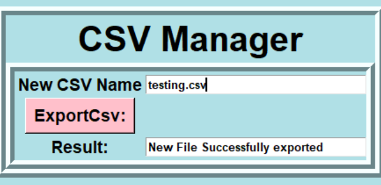
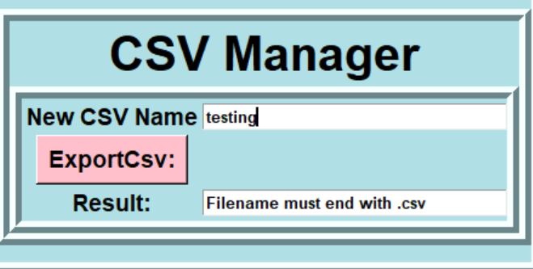

**Export CSV Functionality added**

**Steps to Run:**

Interpreter:
Preferably Python 3+ 

Note: Jetbrains IDE PyCharm can directly run the main file,
    so no installation necessary if present

**Installation (If required):**

Windows PS Terminal:

https://www.python.org/downloads/ (link to install)

    python3 --version #(check installation after)
    
Mac OS Termial:
    
https://www.python.org/downloads/ (link to install)

    python -V #(check installation after)    

Linux (Ubuntu 16+) Terminal:

    $ sudo apt-get update

    $ sudo apt-get install python3.9 #(3.9 in this case)

    $ sudo apt install python3-pip

    $ python3 --version #(check python installed)

    $ pip3 --version  #(check pip installed)

**Running:**

Windows PowerShell(Most preferred) or Mac OS Terminal:

    $ python3 main.py #(tkinter should be included in python 3 core)

    #if above is missing ttk run:
    $ sudo apt install python3-tk #(req library)
Linux(Least preferred): 

https://sourceforge.net/projects/xming/?source=typ_redirect 
(install xming if missing)

    $ sudo apt install python3-tk 
    $ export DISPLAY=:0
    $ python3 main.py
    #May be possible to directly run the script, but
    #Windows WSL with Ubuntu appears to require more setup
    
**THE GUI**

The Gui is fairly simple, with a focus on practicality, clarity, 
and ease of use. The primary interaction involves representing csv files as
data inventory items. In this particular app, Data is split by 

Category,Products,Name,Price,Quantity, 

**Product Listing (Left Side):**

only the last 3 are visible to the user on the **Product Listing** box for display, while the other 2
fields are used for listing same Category/Products together through the two combo boxes.

examples:

,,

The list will automatically update to display all the items that follow under the category and product criteria.

**Product Manager (Right Side):**

**Product Input:**

The right side contains the product manager, this is where items can be created, modified, or deleted, which is 
triggered by the buttons, any error with the inputs specified will be shown in the output box.

examples:
,,

**CSV Manager:**
The CSV Manager creates and exports a copy of the current state of the test.csv into a
new csv file (if no pathway is specified the file is created in the same directory as the existing code).

ex.
,,

**Some Future Additions:**
In the future, instead of static csv, I would likely integrate a database that contains inventory items.
These items can be represented as json files initially and converted to a csv format. Would likely need to include a 
pathway to credentials for making api queries to the database.

For the sake of running across different operating systems or environments, I may containerize these functions with
docker and run as a docker container, this would require more installations but would ensure required packages are installed
in a more organized fashion.
